# Job Assistant - System Design

This document provides a comprehensive visual overview of the Job Assistant platform architecture.

## System Architecture Diagram

```mermaid
graph TB
    subgraph "Frontend - Next.js 16 App Router"
        Landing["/\n(Landing Page)"]
        Login["/login"]
        Signup["/signup"]
        Verify["/verify"]
        Dashboard["/dashboard\n(Main Dashboard)"]
        Onboarding["/onboarding\n(3-step wizard)"]
        CV["/cv"]
        Prefs["/preferences"]
        Sub["/subscription"]
        Jobs["/jobs"]
        Exports["/exports"]
        Notifs["/notifications"]
        Admin["/admin"]
        Settings["/settings"]

        AuthContext["AuthContext\n(JWT + localStorage)"]
        APIClient["API Client Layer\n(fetchApi wrapper)"]
    end

    subgraph "Backend - Express 5 API Server"
        subgraph "Core Infrastructure"
            Auth["middleware/auth.ts\n(JWT verify)"]
            ReqSub["middleware/require-subscription.ts\n(Feature gating)"]
            ReqAdmin["middleware/require-admin.ts\n(Admin check)"]
            Validate["lib/validate.ts\n(Zod validation)"]
            ErrorHandler["lib/error-handler.ts\n(Global error)"]
            Logger["lib/logger.ts\n(Pino)"]
            Email["lib/email.ts\n(Nodemailer)"]
        end

        subgraph "Module: Users"
            UserRoutes["/api/users"]
            UserController["users.controller"]
            UserService["users.service"]
            UserSchemas["users.schemas"]
        end

        subgraph "Module: CV"
            CVRoutes["/api/cv"]
            CVController["cv.controller"]
            CVService["cv.service"]
            CVSchemas["cv.schemas"]
        end

        subgraph "Module: Preferences"
            PrefRoutes["/api/preferences"]
            PrefController["preferences.controller"]
            PrefService["preferences.service"]
            PrefSchemas["preferences.schemas"]
        end

        subgraph "Module: Subscriptions"
            SubRoutes["/api/subscriptions"]
            SubController["subscriptions.controller"]
            SubService["subscriptions.service"]
            SubSchemas["subscriptions.schemas"]
        end

        subgraph "Module: Jobs"
            JobRoutes["/api/jobs"]
            JobController["jobs.controller"]
            JobService["jobs.service"]
            JobSchemas["jobs.schemas"]
        end

        subgraph "Module: Matching"
            MatchRoutes["/api/matching"]
            MatchController["matching.controller"]
            MatchService["matching.service"]
            MatchSchemas["matching.schemas"]
        end

        subgraph "Module: CSV"
            CSVRoutes["/api/csv"]
            CSVController["csv.controller"]
            CSVService["csv.service"]
            CSVSchemas["csv.schemas"]
        end

        subgraph "Module: Notifications"
            NotifRoutes["/api/notifications"]
            NotifController["notifications.controller"]
            NotifService["notifications.service"]
            NotifSchemas["notifications.schemas"]
        end

        subgraph "Module: Tasks"
            TaskRoutes["/api/tasks"]
            TaskController["tasks.controller"]
            TaskService["tasks.service"]
        end

        subgraph "Module: Admin"
            AdminRoutes["/api/admin"]
            AdminController["admin.controller"]
            AdminService["admin.service"]
        end

        subgraph "Task Processing System"
            TaskProcessor["lib/task-processor.ts\n(DB-polling worker)"]
            JobFetchWorker["workers/job-fetch-worker.ts"]
            MatchingWorker["workers/matching-worker.ts"]
            CSVWorker["workers/csv-generation-worker.ts"]
            EmailWorker["workers/email-delivery-worker.ts"]
        end
    end

    subgraph "Database - PostgreSQL (Supabase)"
        subgraph "Core Tables"
            UsersTable["users\n(auth + profile)"]
            CVsTable["cvs\n(snapshots)"]
            PrefsTable["job_preferences\n(1:1 with user)"]
            SubsTable["subscriptions"]
            PlansTable["subscription_plans"]
            PaymentsTable["payment_history"]
        end

        subgraph "Job Tables"
            JobsTable["jobs\n(from Adzuna)"]
            FetchLogsTable["job_fetch_logs"]
            MatchBatchTable["match_batches"]
            MatchResultsTable["match_results"]
        end

        subgraph "Export Tables"
            CSVExportsTable["csv_exports"]
            NotifsTable["notifications"]
            NotifPrefsTable["notification_preferences"]
        end

        subgraph "System Tables"
            TasksTable["tasks\n(queue)"]
            MatchLogsTable["matching_logs"]
            EmailLogsTable["email_logs"]
        end
    end

    subgraph "External Services"
        Adzuna["Adzuna API\n(Job listings)"]
        SMTP["SMTP Server\n(Email delivery)"]
    end

    %% Frontend to API Client
    Landing --> APIClient
    Login --> AuthContext
    Signup --> AuthContext
    Dashboard --> APIClient
    CV --> APIClient
    Prefs --> APIClient
    Sub --> APIClient
    Jobs --> APIClient
    Exports --> APIClient
    Notifs --> APIClient
    Admin --> APIClient
    Settings --> APIClient
    AuthContext --> APIClient

    %% API Client to Backend Routes
    APIClient -->|POST /signup, /login| UserRoutes
    APIClient -->|GET/POST/PUT /cv| CVRoutes
    APIClient -->|GET/POST/PUT /preferences| PrefRoutes
    APIClient -->|GET/POST /subscriptions| SubRoutes
    APIClient -->|GET /jobs| JobRoutes
    APIClient -->|POST /matching/run| MatchRoutes
    APIClient -->|POST /csv/generate| CSVRoutes
    APIClient -->|GET/POST /notifications| NotifRoutes
    APIClient -->|GET /admin/*| AdminRoutes

    %% Backend Routes to Controllers
    UserRoutes --> Auth
    UserRoutes --> UserController
    CVRoutes --> Auth
    CVRoutes --> CVController
    PrefRoutes --> Auth
    PrefRoutes --> PrefController
    SubRoutes --> Auth
    SubRoutes --> SubController
    JobRoutes --> Auth
    JobRoutes --> ReqSub
    JobRoutes --> JobController
    MatchRoutes --> Auth
    MatchRoutes --> ReqSub
    MatchRoutes --> MatchController
    CSVRoutes --> Auth
    CSVRoutes --> ReqSub
    CSVRoutes --> CSVController
    NotifRoutes --> Auth
    NotifRoutes --> NotifController
    AdminRoutes --> Auth
    AdminRoutes --> ReqAdmin
    AdminRoutes --> AdminController

    %% Controllers to Services
    UserController --> UserService
    CVController --> CVService
    PrefController --> PrefService
    SubController --> SubService
    JobController --> JobService
    MatchController --> MatchService
    CSVController --> CSVService
    NotifController --> NotifService
    AdminController --> AdminService

    %% Services to Database
    UserService --> UsersTable
    CVService --> CVsTable
    PrefService --> PrefsTable
    SubService --> SubsTable
    SubService --> PlansTable
    SubService --> PaymentsTable
    JobService --> JobsTable
    JobService --> FetchLogsTable
    MatchService --> MatchBatchTable
    MatchService --> MatchResultsTable
    MatchService --> MatchLogsTable
    CSVService --> CSVExportsTable
    NotifService --> NotifsTable
    NotifService --> NotifPrefsTable
    NotifService --> EmailLogsTable
    TaskService --> TasksTable
    AdminService --> UsersTable
    AdminService --> FetchLogsTable
    AdminService --> MatchLogsTable
    AdminService --> EmailLogsTable
    AdminService --> TasksTable

    %% Task Processing Flow
    MatchController -->|Enqueue| TasksTable
    CSVController -->|Enqueue| TasksTable
    JobController -->|Enqueue| TasksTable
    NotifService -->|Enqueue| TasksTable

    TaskProcessor -->|Poll every 5s| TasksTable
    TaskProcessor --> JobFetchWorker
    TaskProcessor --> MatchingWorker
    TaskProcessor --> CSVWorker
    TaskProcessor --> EmailWorker

    %% Workers to Services/Tables
    JobFetchWorker --> JobService
    JobFetchWorker --> Adzuna
    MatchingWorker --> MatchService
    MatchingWorker --> CVsTable
    MatchingWorker --> PrefsTable
    MatchingWorker --> JobsTable
    CSVWorker --> CSVService
    CSVWorker --> MatchResultsTable
    EmailWorker --> Email
    EmailWorker --> EmailLogsTable

    %% Email Service
    NotifService --> Email
    SubService --> Email
    Email --> SMTP

    %% Styling
    classDef frontend fill:#e1f5ff,stroke:#01579b,stroke-width:2px
    classDef backend fill:#fff3e0,stroke:#e65100,stroke-width:2px
    classDef database fill:#f3e5f5,stroke:#4a148c,stroke-width:2px
    classDef external fill:#e8f5e9,stroke:#1b5e20,stroke-width:2px
    classDef worker fill:#fff9c4,stroke:#f57f17,stroke-width:2px

    class Landing,Login,Signup,Verify,Dashboard,Onboarding,CV,Prefs,Sub,Jobs,Exports,Notifs,Admin,Settings,AuthContext,APIClient frontend
    class Auth,ReqSub,ReqAdmin,Validate,ErrorHandler,Logger,Email,UserRoutes,CVRoutes,PrefRoutes,SubRoutes,JobRoutes,MatchRoutes,CSVRoutes,NotifRoutes,TaskRoutes,AdminRoutes,UserController,CVController,PrefController,SubController,JobController,MatchController,CSVController,NotifController,TaskController,AdminController,UserService,CVService,PrefService,SubService,JobService,MatchService,CSVService,NotifService,TaskService,AdminService backend
    class UsersTable,CVsTable,PrefsTable,SubsTable,PlansTable,PaymentsTable,JobsTable,FetchLogsTable,MatchBatchTable,MatchResultsTable,CSVExportsTable,NotifsTable,NotifPrefsTable,TasksTable,MatchLogsTable,EmailLogsTable database
    class Adzuna,SMTP external
    class TaskProcessor,JobFetchWorker,MatchingWorker,CSVWorker,EmailWorker worker
```



## Architecture Overview

### Frontend Layer (Blue)
- **Framework**: Next.js 16 with App Router
- **Authentication**: JWT stored in localStorage, synced to cookies for middleware
- **Pages**: 14 routes covering landing, auth, dashboard, and all feature modules
- **API Client**: Centralized `fetchApi()` wrapper with automatic token injection

### Backend Layer (Orange)
- **Framework**: Express 5 with native async error handling
- **Architecture**: Modular design with 10 feature modules
- **Pattern**: Each module follows routes → controller → service → database
- **Middleware**: JWT auth, subscription gating, admin checks, Zod validation

### Database Layer (Purple)
- **Database**: PostgreSQL on Supabase
- **ORM**: Drizzle ORM with type-safe queries
- **Tables**: 18 tables organized into 4 domains:
  - **Core**: Users, CVs, preferences, subscriptions
  - **Jobs**: Job listings, fetch logs, match batches/results
  - **Exports**: CSV exports, notifications, preferences
  - **System**: Task queue, logs (matching, email)

### Task Processing (Yellow)
- **Engine**: DB-polling worker (polls every 5s)
- **Workers**: 4 specialized workers for async operations:
  - Job fetch (Adzuna API integration)
  - Matching (rule-based scoring)
  - CSV generation (in-memory, no filesystem)
  - Email delivery (Nodemailer + SMTP)

### External Services (Green)
- **Adzuna API**: Job listings source
- **SMTP**: Email delivery (optional; logs to DB if not configured)

## Key Data Flows

### 1. User Authentication
```
Frontend → /api/users/login → JWT generation → localStorage + cookie → Protected routes
```

### 2. Job Matching
```
Dashboard → /api/matching/run → Task enqueued → TaskProcessor → MatchingWorker →
Score calculation → match_results table → Notification sent
```

### 3. CSV Export
```
/exports → /api/csv/generate → Task enqueued → CSVWorker → CSV in memory →
Email with attachment → csv_exports table
```

### 4. Job Ingestion
```
Admin → /api/jobs/fetch → Task enqueued → JobFetchWorker → Adzuna API →
Deduplication → jobs table → job_fetch_logs
```

## Module Status

All 10 backend modules are complete:
- ✅ Users (auth, profile)
- ✅ CV (snapshots, versions)
- ✅ Preferences (CRUD)
- ✅ Subscriptions (plans, payments)
- ✅ Jobs (Adzuna integration)
- ✅ Matching (5-dimension scorer)
- ✅ CSV (exports, downloads)
- ✅ Notifications (email delivery)
- ✅ Tasks (queue management)
- ✅ Admin (observability)

All frontend pages are complete (14 routes).

## Viewing This Diagram

### Option 1: GitHub
This file is already in Markdown with Mermaid code block - GitHub will render it automatically.

### Option 2: Mermaid Live Editor
1. Copy the Mermaid code block
2. Go to https://mermaid.live/
3. Paste and export as SVG/PNG

### Option 3: Excalidraw
1. Convert via Mermaid Live Editor (export as SVG)
2. Import SVG into https://excalidraw.com/
3. Edit and customize as needed

### Option 4: VS Code
Install the "Markdown Preview Mermaid Support" extension to view this file directly.
